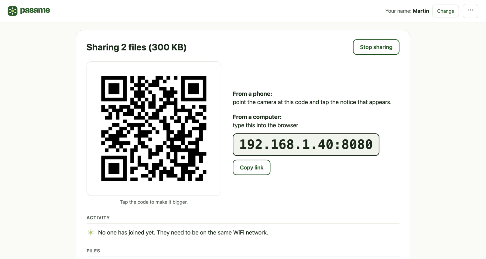
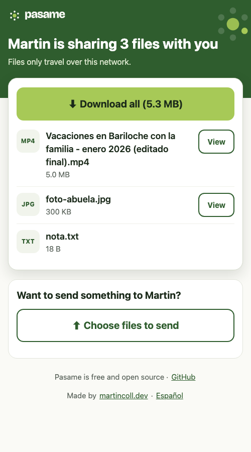

<p align="center"><a href="README.md">Español</a> · <b>English</b></p>

<p align="center">
  
</p>

<p align="center"><b>Send files to any phone or computer nearby.</b><br>No cables, no accounts, nothing to install on the receiving side.</p>

<p align="center">
  <a href="https://github.com/KonixDev/pasame/releases"></a>
  <a href="https://github.com/KonixDev/pasame/stargazers"></a>
  <a href="LICENSE"></a>
</p>

---

In 2026, moving a video from your phone to the laptop next to it is still a hassle: cables, apps that compress everything, accounts, emailing yourself. **Pasame** solves it with something every device already has: a web browser.

1. Open Pasame on your computer and choose the files.
2. The other person points their phone camera at the code on your screen (or types the address into any browser).
3. Done: they download what you shared and, if they want, send files back to you.

> **One person has Pasame on a computer. The other only needs a browser.**
> Several people can join at once: one shares, many receive.

*Pasame* is Argentine Spanish for "pass it to me", which is exactly what you say across the table.

<table>
<tr>
<td width="68%"></td>
<td width="32%"></td>
</tr>
<tr>
<td align="center"><sub>On the computer that shares</sub></td>
<td align="center"><sub>On the phone that receives</sub></td>
</tr>
</table>

## Download

Get the version for your computer from **[Releases](https://github.com/KonixDev/pasame/releases/latest)**:

| Your computer | File |
|---|---|
| Windows 10 or 11 | `Pasame-Windows.exe` (or `Pasame-Windows-arm64.exe` on ARM devices) |
| Mac (macOS 12 or newer, Intel or Apple silicon) | `Pasame-macOS.zip` |
| Linux (Raspberry Pi included) | `pasame-linux-amd64.tar.gz`, `-arm64` or `-armv7` |

There is nothing to install: it is a single file you double-click. The receiving side **installs nothing at all**: any browser from 2017 onwards works, including iPhone, Android, smart TVs and e-readers.

### The first time you open it

Pasame is not yet signed by Microsoft or Apple, so your computer will warn you the first time. You only do this once.

- **Windows:** if you see "Windows protected your PC", click **More info** → **Run anyway**. If a "Windows Defender Firewall" window appears, click **Allow access**: this lets the phone see your computer.
- **Mac:** unzip the file, move **Pasame** to Applications and open it. If it says it can't be opened, go to **System Settings → Privacy & Security**, scroll to the bottom and click **Open Anyway**.
- **Linux:** extract it and run `./pasame`. To pick files with a window you need `zenity` or `kdialog` (GNOME and KDE ship them).

## Good to know

- **Both devices need to be on the same WiFi network** (or one plugged into the same router).
- WiFi in cafés, hotels and airports often blocks devices from seeing each other. Sharing over the internet is coming in the next version.
- If you close the Pasame tab, the app quits by itself after 2 minutes (unless something is still downloading).
- Files sent to you land in **Downloads → Pasame**.
- Downloads resume on their own if the WiFi drops, and "Download all" builds a ZIP on the fly, with no waiting and no extra disk space.
- Pasame speaks English and Spanish. It picks your browser's language, and you can switch it from the ⋯ menu. The receiving page follows the language of the person sharing, with a one-tap switch.

## What it doesn't promise

On your WiFi, anyone connected to that same network who has the link can see what you share while the app is open. Files never leave your network, but they are not encrypted inside it. Don't use Pasame on a network you don't trust.

## Status

**v0.1 · local network.** Working today: sharing files and folders, QR code and short address, several receivers at once, on-the-fly ZIP, resumable downloads, sending files back (including drag and drop onto the page), English and Spanish, single instance.

Next (see the [plan](docs/superpowers/plans/2026-09-21-pasame-02-tunel-y-distribucion.md), in Spanish): sharing over the internet with a 4-digit code, a Mac app signed by Apple, installers, and the [pasame.com.ar](https://pasame.com.ar) website.

## For developers

Go 1.27, a single binary with no system dependencies (`CGO_ENABLED=0`) and two direct dependencies ([zenity](https://github.com/ncruces/zenity) for native dialogs and [go-qrcode](https://github.com/skip2/go-qrcode)). The interface is plain HTML, CSS and JavaScript with no framework, embedded in the binary; the receiving page even works with JavaScript turned off.

```bash
make test     # unit and integration tests (go test -race)
make build    # ./pasame
make cross    # builds all 7 targets (Windows, macOS, Linux; x64 and ARM)
./pasame photo.jpg video.mp4   # opens already sharing those files
scripts/release.sh 0.1.0       # builds the release files into dist/ (on macOS)
```

| Folder | What's inside |
|---|---|
| `cmd/pasame` | The binary: wires everything together, opens the browser, handles shutdown. |
| `internal/share` | What the receiver sees (port 8080): page, downloads, ZIP, uploads. |
| `internal/control` | The sender's interface, only on `127.0.0.1` and protected by a token. |
| `internal/core` | Orchestrates the session, the addresses and the auto-quit rule. |
| `internal/addr` | Picks the right network (ignores VPNs, Docker and the like). |
| `internal/i18n` | Every string on the receiving page, in Spanish and English. |
| `web/` | HTML, CSS and JS for both screens. |
| `docs/marca` | [Brand guidelines](docs/marca/manual-de-marca.html) (in Spanish), logos and colors. |
| `docs/superpowers` | Technical design and implementation plans (in Spanish). |

The design decisions and their reasoning live in the [design document](docs/superpowers/specs/2026-09-21-share-now-design.md) (in Spanish). Two criteria rule the whole project: **work on as many devices as possible** and **be usable by anyone, without help**.

## If it helped you

Give the repo a ⭐: it helps more people find it. And if something didn't work, [open an issue](https://github.com/KonixDev/pasame/issues) telling us which computer and which phone you used.

---

<p align="center">Made by <a href="https://martincoll.dev">martincoll.dev</a> · <a href="LICENSE">MIT</a> license</p>
