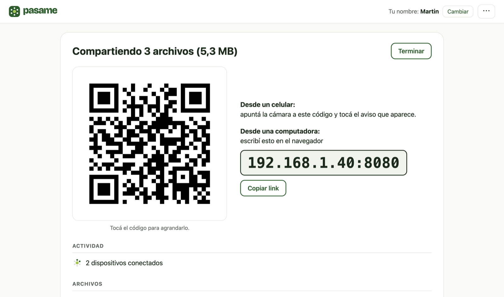
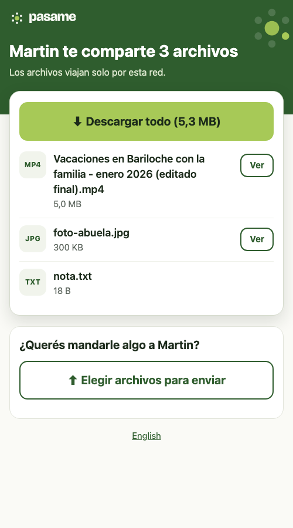

<p align="center"><b>Español</b> · <a href="README.en.md">English</a></p>

<p align="center">
  
</p>

<p align="center"><b>Pasá archivos a cualquier celular o computadora que esté cerca.</b><br>Sin cable, sin cuentas, sin instalar nada del lado de quien recibe.</p>

<p align="center">
  <a href="https://github.com/KonixDev/pasame/releases"></a>
  <a href="https://github.com/KonixDev/pasame/stargazers"></a>
  <a href="LICENSE"></a>
</p>

---

En 2026, pasar un video del celular a la compu de al lado sigue siendo un lío: cables, apps que comprimen, cuentas, mails a uno mismo. **Pasame** lo resuelve con lo que ya tiene cualquier dispositivo, que es un navegador.

1. Abrís Pasame en tu computadora y elegís los archivos.
2. La otra persona apunta la cámara del celular al código que aparece (o escribe la dirección en su navegador).
3. Listo: descarga lo que compartiste y, si quiere, te manda archivos de vuelta.

> **Una persona tiene Pasame en una computadora. La otra, solo un navegador.**
> Pueden entrar varias a la vez: una comparte, muchas reciben, como en una ronda de mate.

<table>
<tr>
<td width="68%"></td>
<td width="32%"></td>
</tr>
<tr>
<td align="center"><sub>En la computadora que comparte</sub></td>
<td align="center"><sub>En el celular que recibe</sub></td>
</tr>
</table>

## Descargar

Entrá a **[konixdev.github.io/pasame](https://konixdev.github.io/pasame/)**: el botón elige la versión para tu computadora. También están todas en **[Releases](https://github.com/KonixDev/pasame/releases)**:

| Tu computadora | Archivo |
|---|---|
| Windows 10 u 11 | `Pasame-Windows.exe` (o `Pasame-Windows-arm64.exe` en equipos ARM) |
| Mac (macOS 12 o más nuevo, Intel o Apple) | `Pasame-macOS.dmg` |
| Linux (incluida Raspberry Pi) | `pasame-linux-amd64.tar.gz`, `-arm64` o `-armv7`, o el `.deb` para Ubuntu y Debian |

No hace falta instalar nada: es un solo archivo que se abre con doble clic. Del lado de quien recibe **no se instala nada**: sirve cualquier navegador de 2017 en adelante, incluidos iPhone, Android, Smart TVs y e-readers.

### La primera vez que lo abrís

Pasame todavía no está verificado por Apple ni por Microsoft, así que la primera vez la computadora lo frena. Se hace una sola vez; después abre sin avisos. Guía con más detalle: [cómo abrirla](https://konixdev.github.io/pasame/como-abrir.html).

**Mac**

1. Abrí `Pasame-macOS.dmg` y arrastrá **Pasame** a la carpeta **Aplicaciones**.
2. Abrí Pasame desde Aplicaciones. Aparece un aviso con dos botones: tocá **Listo**. *(No toques "Trasladar a la Papelera": borra la app.)*
3. Abrí **Ajustes del Sistema → Privacidad y seguridad** y bajá hasta el final, a **Seguridad**.
4. Al lado del mensaje que nombra a Pasame, tocá **Abrir de todos modos**. Si no aparece, repetí el paso 2: el botón se muestra solo durante un rato.
5. Poné tu contraseña y, en el último aviso, tocá otra vez **Abrir de todos modos**.

Se abre una pestaña del navegador: esa pestaña es la app (no aparece en el Dock, a propósito). Si aun así no abre, en la Terminal: `xattr -dr com.apple.quarantine /Applications/Pasame.app`.

**Windows**

1. Doble clic en `Pasame-Windows.exe`.
2. En el aviso azul "Windows protegió tu PC", tocá **Más información** y después **Ejecutar de todas formas**.
3. Si aparece el "Firewall de Windows Defender", tocá **Permitir acceso**: es para que el celular pueda ver tu computadora.

**Linux:** instalá el `.deb` (queda en el menú de aplicaciones) o descomprimí el `.tar.gz` y ejecutá `./pasame`. Para elegir archivos con una ventana hace falta `zenity` o `kdialog` (vienen en GNOME y KDE).

## Lo que conviene saber

- **Los dos dispositivos tienen que estar en la misma red WiFi** (o uno por cable al mismo router).
- Si están en el WiFi de un bar, un hotel o un aeropuerto, esas redes suelen bloquear esto: usá **Compartir por internet** (abajo).
- En la Mac podés soltar archivos sobre el ícono de Pasame para compartirlos directo.
- Si cerrás la pestaña de Pasame, la app se cierra sola a los 2 minutos (si no hay nada bajando).
- Lo que te mandan queda en **Descargas → Pasame**.
- Las descargas se retoman solas si se corta el WiFi, y "Descargar todo" arma un ZIP al vuelo, sin esperar ni ocupar espacio extra.
- Pasame habla español e inglés: toma el idioma de tu navegador y lo cambiás desde el menú ⋯. La página de quien recibe sigue el idioma de quien comparte, con un cambio de un toque.

## Si están lejos o en otra red

Tocá **Compartir por internet**. Aparece un código nuevo y una clave de 4 números. El código del celular ya trae la clave; desde una computadora, se escribe la dirección y después la clave.

Mientras está activo, todos necesitan la clave, también en tu WiFi. Los archivos pasan por los servidores de Cloudflare (un servicio gratuito que puede no estar disponible). Al tocar **Terminar**, o **Volver a compartir solo por WiFi**, el link de internet deja de funcionar.

## Qué no promete

- En tu WiFi, cualquiera conectado a esa misma red que tenga el link puede ver lo que compartís mientras la app está abierta.
- Por internet, los archivos van cifrados hasta Cloudflare, pero Cloudflare podría verlos.
- No uses Pasame en una red en la que no confíes.

## Estado

**v0.3 · red local e internet.** Funciona: compartir archivos y carpetas, código QR y dirección corta, varios receptores a la vez, ZIP al vuelo, descargas reanudables, mandar archivos de vuelta, compartir por internet con clave de 4 números, soltar archivos sobre el ícono en la Mac, `.dmg` y `.deb`, toda la app en español e inglés.

Próximo: la app de Mac verificada por Apple (hace falta una cuenta de Apple Developer) y el dominio [pasame.com.ar](https://pasame.com.ar).

## Para desarrolladores

Go 1.27, un solo binario sin dependencias del sistema (`CGO_ENABLED=0`), dos dependencias directas ([zenity](https://github.com/ncruces/zenity) para los diálogos nativos y [go-qrcode](https://github.com/skip2/go-qrcode)), más [mdns](https://github.com/hashicorp/mdns) solo en los builds con `-tags mdns`. Para compartir por internet baja [cloudflared](https://github.com/cloudflare/cloudflared) la primera vez que se usa, con versión y SHA-256 fijados. La interfaz es HTML, CSS y JavaScript sin frameworks, embebida en el binario; la página de quien recibe funciona incluso sin JavaScript.

```bash
make test     # tests unitarios y de integración (go test -race)
make build    # ./pasame
make cross    # compila los 7 targets (Windows, macOS, Linux; x64 y ARM)
./pasame foto.jpg video.mp4   # abre compartiendo esos archivos
go build -tags mdns ./cmd/pasame   # con pasame.local
goreleaser release --snapshot --clean --skip=sign   # los archivos de una release, en dist/
```

Releases: pushear un tag `vX.Y.Z` corre `.github/workflows/release.yml` (GoReleaser + `.dmg`). Para que Mac salga verificada por Apple, cargar los secrets `MACOS_*` (ver la Tarea 8 del [plan 2](docs/superpowers/plans/2026-09-21-pasame-02-tunel-y-distribucion.md)); sin ellos, la release sale como pre-release. Antes de una versión estable: `test/manual/matriz.md` y `test/manual/tunel.md` completos.

| Carpeta | Qué hay |
|---|---|
| `cmd/pasame` | El binario: arma todo, abre el navegador, maneja el cierre. |
| `internal/share` | Lo que ve quien recibe (puerto 8080): página, descargas, ZIP, subidas. |
| `internal/control` | La interfaz de quien comparte, solo en `127.0.0.1` y protegida con un token. |
| `internal/core` | Orquesta la sesión, las direcciones y la regla de cierre automático. |
| `internal/addr` | Elige la red correcta (ignora VPN, Docker y similares). |
| `internal/tunnel` | Baja, verifica y corre `cloudflared` para compartir por internet. |
| `site/` | El sitio de descarga (GitHub Pages). |
| `packaging/` | Íconos, `.app` de Mac, metadatos del `.exe` y lanzador de Linux. |
| `web/` | HTML, CSS y JS de las dos pantallas. |
| `docs/marca` | [Manual de marca](docs/marca/manual-de-marca.html), logos y colores. |
| `docs/superpowers` | Diseño técnico y planes de implementación. |

Las decisiones de diseño y sus porqués están en el [documento de diseño](docs/superpowers/specs/2026-09-21-share-now-design.md). Los dos criterios que mandan en todo el proyecto: **que funcione en la mayor cantidad de dispositivos posible** y **que lo pueda usar cualquier persona, sin ayuda**.

## Si te sirvió

Dale una ⭐ al repo: ayuda a que más gente lo encuentre. Y si algo no anduvo, [abrí un issue](https://github.com/KonixDev/pasame/issues) contando qué computadora y qué celular usaste.

---

<p align="center">Creado por <a href="https://martincoll.dev">martincoll.dev</a> · Licencia <a href="LICENSE">MIT</a></p>
